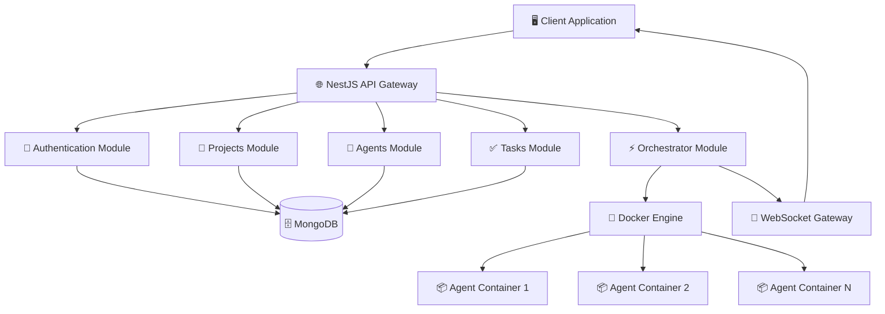

# 🚀 Проект Прометей: Backend

<div align="center">

**Мощная бэкенд-платформа для управления AI-агентами и их задачами**

[](https://nestjs.com/)
[](https://www.typescriptlang.org/)
[](https://www.mongodb.com/)
[](https://www.docker.com/)
[](https://socket.io/)

</div>

---

## ✨ Обзор

**Проект Прометей** представляет собой инновационную backend-систему для управления AI-агентами, их задачами и средами выполнения. Построенная на современном стеке технологий, система обеспечивает надежное, безопасное и масштабируемое API для работы с искусственным интеллектом.

## 🎯 Ключевые Возможности

<div align="center">

| 🔐 **Безопасность** | 📊 **Управление** | ⚡ **Производительность** | 🔄 **Real-time** |
|:---:|:---:|:---:|:---:|
| JWT аутентификация | Полный CRUD | Docker оркестрация | WebSocket уведомления |
| Защищенные маршруты | Вложенные ресурсы | Изолированные среды | Мгновенные обновления |

</div>

### 🛡️ Система Безопасности
- **JWT Authentication**: Надежная система токенов для аутентификации
- **Passport.js Integration**: Продвинутые стратегии авторизации
- **bcrypt Hashing**: Безопасное хэширование паролей

### 📋 Управление Ресурсами
- **Projects Management**: Полный CRUD для управления проектами
- **Agents Management**: Создание и настройка AI-агентов
- **Tasks Management**: Назначение и отслеживание задач
- **Nested Resources**: Иерархическая структура ресурсов

### ⚙️ Оркестрация и Выполнение
- **Docker Integration**: Контейнеризация для изоляции выполнения
- **Task Execution**: Высокоуровневый сервис запуска задач
- **Resource Management**: Эффективное управление ресурсами

### 📡 Real-time Коммуникация
- **WebSocket Gateway**: Мгновенные уведомления
- **Event Broadcasting**: Трансляция событий в реальном времени
- **Live Updates**: Актуальная информация о состоянии системы

## 🛠️ Технологический Стек

<table align="center">
<tr>
<td align="center" width="200px">

**🏗️ Фреймворк**
<br><br>

<br>**NestJS**
<br>*Node.js Framework*

</td>
<td align="center" width="200px">

**📝 Язык**
<br><br>

<br>**TypeScript**
<br>*Type-safe JavaScript*

</td>
<td align="center" width="200px">

**🗄️ База Данных**
<br><br>

<br>**MongoDB**
<br>*с Mongoose ODM*

</td>
</tr>
<tr>
<td align="center" width="200px">

**🔐 Аутентификация**
<br><br>

<br>**JWT + Passport**
<br>*Secure Auth*

</td>
<td align="center" width="200px">

**🐳 Контейнеризация**
<br><br>

<br>**Docker**
<br>*с Dockerode API*

</td>
<td align="center" width="200px">

**🔌 WebSockets**
<br><br>

<br>**Socket.IO**
<br>*Real-time Events*

</td>
</tr>
</table>

### 🧪 Тестирование и Качество
- **Jest**: Фреймворк для unit и интеграционных тестов
- **Supertest**: HTTP assertion библиотека
- **MongoDB-Memory-Server**: In-memory база для тестов
- **100% API Coverage**: Полное покрытие тестами

---

## 🚀 Быстрый Старт

### 📋 Предварительные Требования

> 🔧 **Node.js** >= 16.0.0  
> 🐳 **Docker** >= 20.0.0  
> 🗄️ **MongoDB** >= 5.0.0

### 1️⃣ Клонирование Репозитория

```bash
git clone <URL_ВАШЕГО_РЕПОЗИТОРИЯ>
cd prometheus-backend
```

### 2️⃣ Установка Зависимостей

```bash
npm install
```

### 3️⃣ Настройка Окружения

Создайте файл `.env` в корневой директории:

```env
# 🗄️ База данных MongoDB
DATABASE_URL=mongodb://localhost:27017/prometheus

# 🔐 Секретный ключ JWT (обязательно замените!)
JWT_SECRET=YOUR_SUPER_SECRET_KEY_REPLACE_ME_WITH_STRONG_RANDOM_STRING

# 🌐 URL фронтенда для CORS
FRONTEND_URL=http://localhost:5173
```

> ⚠️ **Важно**: Обязательно замените `JWT_SECRET` на длинную случайную строку в продакшене!

### 4️⃣ Запуск Приложения

#### 🔥 Режим Разработки
```bash
npm run start:dev
```

#### 🚀 Продакшен
```bash
npm run build
npm run start:prod
```

<div align="center">

🎉 **Приложение запущено!**  
Доступно по адресу: [http://localhost:3000](http://localhost:3000)

</div>

---

## 🧪 Тестирование

### Запуск Всех Тестов
```bash
npm run test:e2e
```

### Покрытие Кода
```bash
npm run test:cov
```

<div align="center">

✅ **Полное покрытие API тестами**

</div>

---

## 📚 Документация API

> **Базовый URL**: `http://localhost:3000`

### 🔐 Модуль Authentication

<details>
<summary><strong>📝 Регистрация пользователя</strong></summary>

**`POST /auth/signup`**

Создание нового пользователя в системе.

**Тело запроса:**
```json
{
  "email": "user@example.com",
  "password": "securePassword123",
  "name": "Имя Пользователя"
}
```

**Успешный ответ (201):**
```json
{
  "message": "Пользователь успешно создан",
  "user": {
    "id": "60c72d1f9b1d8c001f8e4d3e",
    "email": "user@example.com",
    "name": "Имя Пользователя"
  }
}
```

</details>

<details>
<summary><strong>🔑 Вход в систему</strong></summary>

**`POST /auth/login`**

Аутентификация пользователя и получение JWT токена.

**Тело запроса:**
```json
{
  "email": "user@example.com",
  "password": "securePassword123"
}
```

**Успешный ответ (200):**
```json
{
  "access_token": "eyJhbGciOiJIUzI1NiIsInR5cCI6IkpXVCJ9...",
  "user": {
    "id": "60c72d1f9b1d8c001f8e4d3e",
    "email": "user@example.com",
    "name": "Имя Пользователя"
  }
}
```

</details>

---

### 📂 Модуль Projects

> 🔒 **Требуется**: `Authorization: Bearer <token>`

<details>
<summary><strong>📋 Управление проектами</strong></summary>

**`GET /projects`** - Получить все проекты пользователя  
**`POST /projects`** - Создать новый проект  
**`GET /projects/:id`** - Получить проект по ID  
**`PUT /projects/:id`** - Обновить проект  
**`DELETE /projects/:id`** - Удалить проект

**Пример создания проекта:**
```json
{
  "name": "Мой AI Проект",
  "description": "Описание проекта",
  "tags": ["AI", "automation", "productivity"]
}
```

</details>

---

### 🤖 Модуль Agents

> 🔒 **Требуется**: `Authorization: Bearer <token>`

<details>
<summary><strong>🤖 Управление AI-агентами</strong></summary>

**`GET /projects/:projectId/agents`** - Список агентов проекта  
**`POST /projects/:projectId/agents`** - Создать нового агента  
**`GET /projects/:projectId/agents/:agentId`** - Получить агента  
**`PUT /projects/:projectId/agents/:agentId`** - Обновить агента  
**`DELETE /projects/:projectId/agents/:agentId`** - Удалить агента

**Пример создания агента:**
```json
{
  "name": "ChatBot Assistant",
  "type": "conversational",
  "model": "gpt-4",
  "systemPrompt": "Ты полезный AI-ассистент...",
  "configuration": {
    "temperature": 0.7,
    "maxTokens": 2048
  }
}
```

</details>

---

### ✅ Модуль Tasks

> 🔒 **Требуется**: `Authorization: Bearer <token>`

<details>
<summary><strong>📋 Управление задачами</strong></summary>

**`GET /projects/:projectId/tasks`** - Список задач проекта  
**`POST /projects/:projectId/tasks`** - Создать новую задачу  
**`GET /projects/:projectId/tasks/:taskId`** - Получить задачу  
**`PUT /projects/:projectId/tasks/:taskId`** - Обновить задачу  
**`DELETE /projects/:projectId/tasks/:taskId`** - Удалить задачу

**Пример создания задачи:**
```json
{
  "title": "Анализ данных",
  "description": "Провести анализ пользовательских данных",
  "agentId": "60c72d1f9b1d8c001f8e4d3e",
  "priority": "high",
  "parameters": {
    "dataSource": "user_analytics.csv",
    "analysisType": "behavioral"
  }
}
```

</details>

---

### ⚡ Модуль Orchestrator

> 🔒 **Требуется**: `Authorization: Bearer <token>`  
> 🔥 **Новая функциональность!**

<details>
<summary><strong>🚀 Запуск выполнения задач</strong></summary>

#### `POST /orchestrator/tasks/:taskId/run`

**Описание**: Асинхронно запускает процесс выполнения задачи. Эндпоинт мгновенно возвращает подтверждение, а весь процесс выполнения транслируется в реальном времени через WebSocket.

**Параметры URL:**

| Параметр | Тип | Обязательный | Описание |
|----------|-----|--------------|----------|
| `taskId` | string | ✅ Да | Уникальный идентификатор задачи |

**Успешный ответ (201 Created):**
```json
{
  "message": "Команда на выполнение задачи принята. Следите за обновлениями в реальном времени.",
  "taskId": "60c72d1f9b1d8c001f8e4d3e",
  "executionId": "exec_abc123def456",
  "status": "initiated"
}
```

**Возможные ошибки:**

| Код | Описание |
|-----|----------|
| `404` | Задача не найдена или не принадлежит пользователю |
| `400` | Задача не может быть выполнена (неверные параметры) |
| `409` | Задача уже выполняется |
| `500` | Внутренняя ошибка системы оркестрации |

</details>

---

## 📡 WebSocket События

Подключение к WebSocket для получения обновлений в реальном времени:

```javascript
const socket = io('http://localhost:3000', {
  auth: {
    token: 'your-jwt-token'
  }
});

// Подписка на события выполнения задач
socket.on('task:execution:started', (data) => {
  console.log('Задача начала выполнение:', data);
});

socket.on('task:execution:progress', (data) => {
  console.log('Прогресс выполнения:', data);
});

socket.on('task:execution:completed', (data) => {
  console.log('Задача завершена:', data);
});

socket.on('task:execution:error', (data) => {
  console.error('Ошибка выполнения:', data);
});
```

---

## 🏗️ Архитектура Системы

<div align="center">



</div>

---

## 🤝 Участие в Разработке

Мы приветствуем вклад в развитие проекта! 

### 🔧 Процесс Разработки

1. **Fork** репозитория
2. Создайте **feature branch**: `git checkout -b feature/amazing-feature`
3. **Commit** изменения: `git commit -m 'Add amazing feature'`
4. **Push** в branch: `git push origin feature/amazing-feature`
5. Откройте **Pull Request**

### 📋 Стандарты Кода

- Используйте **TypeScript** для всего кода
- Следуйте **ESLint** правилам
- Покрывайте новый код **тестами**
- Документируйте **API изменения**

---

## 📄 Лицензия

Этот проект лицензирован под **MIT License** - см. файл [LICENSE](LICENSE) для деталей.

---

<div align="center">

**🚀 Проект Прометей - Будущее AI Управления**

*Создано с ❤️ командой разработчиков*

---

[](https://github.com/username/prometheus-backend/stargazers)
[](https://github.com/username/prometheus-backend/network/members)
[](https://github.com/username/prometheus-backend/issues)

</div>